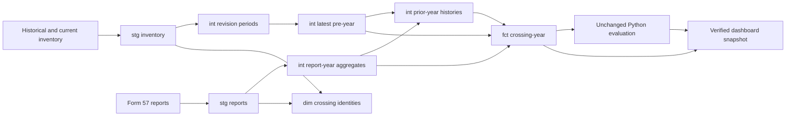

# FRA crossing-risk analytics engineering

A dbt + DuckDB rebuild of a completed rail-safety research panel: **1,526,612
crossing-years, 2014–2025**. SQL makes the historical eligibility, date masking and
incident-history rules inspectable. Python keeps the original model evaluation.

This is an engineering reproduction, not a new research finding. The reference
gradient-boosting average precision is **0.0766 without history → 0.1012 with history**.
Full-build verification artifacts and dashboard summaries record whether this rebuild
actually reproduces those values; CI is a smaller, separate behavioral check.

**Verified:** all 55 reference columns match exactly; all six models' test predictions
match within 1e-12. [Verification scope and limitations](docs/verification.md).

## Five-minute tour

1. [Latest pre-year inventory](models/intermediate/int_inventory_latest_pre_year.sql):
   see which crossings are eligible and why future measurements become null.
2. [History windows](models/intermediate/int_history_windows.sql): see exactly how
   the outcome year is excluded.
3. [Fact table](models/marts/fct_crossing_year.sql): one crossing, one year, one row.
4. [Boundary tests](scripts/check_fixture.py) and [full parity](scripts/check_parity.py):
   inspect independent examples and the 55-column reference comparison.
5. [Engineering decisions](docs/engineering-decisions.md): grain, data quality,
   materialization, chronology, and limitations in plain language.

## Run the small pipeline

Python 3.12; no API keys, warehouse server or raw-data download required.

```bash
python3.12 -m venv .venv
source .venv/bin/activate
pip install -r requirements.txt
python scripts/build.py --fixture
python scripts/test_dashboard.py
streamlit run dashboard.py
```

The fixture deliberately exercises exact January 1 boundaries, conflicting revisions,
closure/reopening, missing years, future measurements, malformed values and duplicate
agency records. It is synthetic and cannot reproduce the research metrics. The dashboard
uses separate small summaries of verified full-data outputs, never the fixture.

`build.py` creates a local ignored profile from `profiles.example.yml`, runs `dbt build`,
generates docs, and checks expected results. dbt artifacts are under `target/`.
For an interactive documentation view after the fixture build:

```bash
export FRA_SOURCES="$PWD/data/fixture/sources"
export CROSSING_DB="$PWD/warehouse/fixture.duckdb"
dbt docs serve --profiles-dir .profiles
```

## Reproduce the full research release

Download the checksum-pinned GitHub release asset, or supply the original frozen
September 6 release folder (about 1.1 GB of source CSVs). Large data files are outside
Git history; [the archive receipt](provenance/frozen_archive.json) and
[source manifest](provenance/frozen_data_manifest.json) retain download URLs and hashes.
Live FRA downloads are not guaranteed to match that vintage.

```bash
python scripts/fetch_frozen.py
python scripts/build.py --release data/frozen-2026-09-06
python scripts/evaluate_mart.py --release data/frozen-2026-09-06
python scripts/export_dashboard.py
```

The build verifies source hashes, runs the full row-count check, and compares every
reference value before exporting a Python-compatible panel. Evaluation must reproduce
all six AP values and every test prediction within absolute tolerance 1e-12. A mismatch
stops the process; it does not trigger model tuning. Allow several minutes and at least
8 GB free memory/disk headroom. The original sources and research code are not modified.

## Data model



The identity dimension includes report-only crossings; it is not the eligible cohort.
Year-specific state and warning-device attributes stay in the fact table. Reports
outside the eligible cohort are retained, not forced into the modeling population.

## What the result means—and does not mean

A positive row has at least one Form 57 report. Reports are not deduplicated physical
accidents, and a zero is not proof that no incident occurred. The study reconstructs
reported revision dates, not verified real-time information availability. It does not
establish causal effects, geographic transfer, superiority to the full FRA prediction
system, or suitability for operational safety decisions.

**Known baseline issue:** exact reproduction preserves a compact-date parsing quirk
affecting warning-device masks in 1,158 crossing-years. [Explanation and next decision](docs/legacy-date-parsing.md).

The dashboard's top-10% capture reranks within the selected state/year and shows both
the numerator and denominator. It is a descriptive capacity comparison, not a claim
that a state would receive that allocation under national ranking.

## Authorship and learning

Christopher Li owns the project and specified the research-preservation requirements
and portfolio objective. The existing research was AI-assisted. Codex implemented this
engineering rebuild, including SQL, tests, CI, documentation and dashboard, and ran the
reported checks. The copied research files are identified under `reference/`.

This is **not represented as independently hand-written work**. Personal walkthrough
and independent reproduction are next learning milestones, not completed claims.
[Study questions](docs/interview-questions.md) provide a structured review path.

## Repository safety

No `.env`, real `profiles.yml`, local databases, credentials or bulk source files belong
in commits. CI checks tracked file paths, common credential patterns and the 50 MB
per-file ceiling. Secret-pattern detection is not a guarantee; review staged contents.
GitHub Actions runs the fixture, dbt tests/docs, and dashboard tests on each push/PR.
